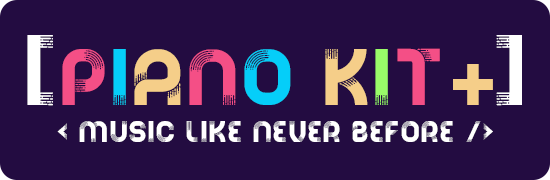
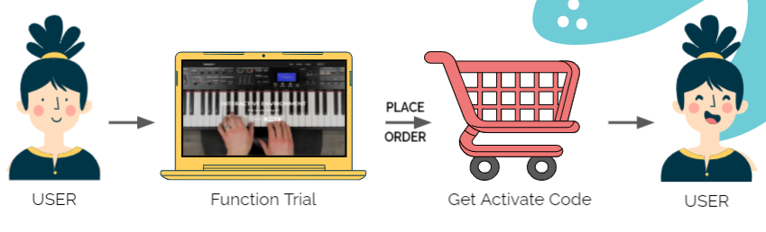
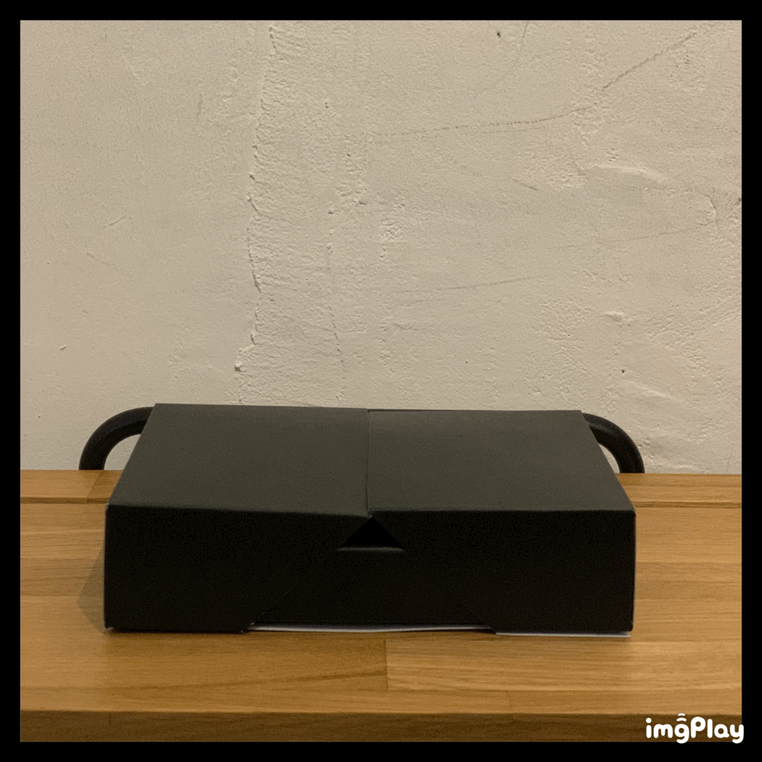
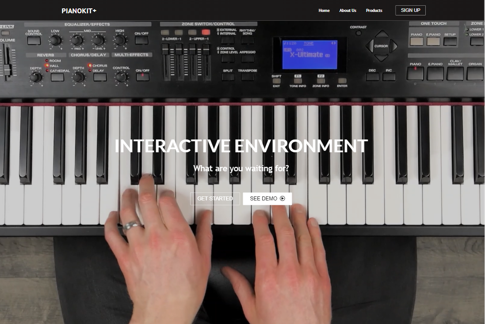
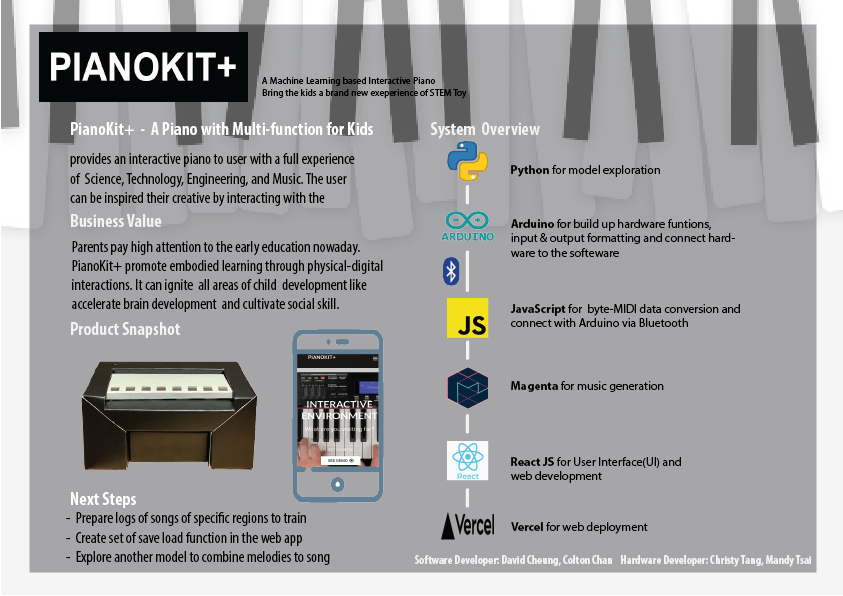

# DataScience_CapStone

## Introduction:
The goal of this project is to provide an interactive toy and services for children to develop interests in piano, or general music. This project involves *hardware (Arduino), software (React framework), and machine learning (Magenta)*. For the demonstration, please click the link below so that you can gain an overall picture how it works.

https://youtu.be/_ltfEAWUCWY

The demonstration in the video is the service that users can purchase after trying the functionality, which are hosted by the website, themselves. The concept of the business can be descripted as following flow chart:

Customer will get an activation code after purchasing the project, the activation code will provide an account with unqiue token, when user is trying to use thee service, the token will be validated and finally redirect them to the service webpage. The process mentioned above is done by our server, make customer easy to access the service.

## Project Details:
### Hardware:

Developed by teammates, hardware is one of the most important part in our project. This part involves hardware design (how to make a paper transform into piano shape , how to make paper conductive, etc.) and arduino development, transmitting, converting signals to the website and handling logics related to the circuit itself. 

### Software:

Mainly developed by me and another teammate, this website includes trial for user to try the functionality and login page for user to really use the functionality after purchasing the product. Software development handles converting singals from the hardware ,general logics for implementing a website and machine learning part.

### Machine Learning/ Deep Learning:

We employed magenta.js, developed by Google, to handle the generation part when user is done pressing desired button on the piano and would like to generate subsequent music according to the music they inputed. 

## More information:

For more information, please contact
#### Hardware development

Christy, tangkaying@gmail.com

Mandy, mandy200525@gmail.com
#### Software development

Colton, chantszchau0921@gmail.com

David, cheungyuk123@gmail.com
